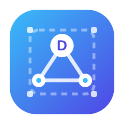

<p align="center">
  
</p>

<h1 align="center">DockLab</h1>

<p align="center">
  <strong>本地分子对接可视化科研平台 · Local Molecular Docking &amp; Visualization Platform</strong>
</p>

<p align="center">
  English version: <a href="README.en.md">README.en.md</a>
</p>

<p align="center">
  
  
  
  
  
  
  
  
  <a href="https://github.com/MCXDL/docklab/discussions"></a>
</p>

## 项目简介

DockLab 是一款面向药物发现与计算化学研究的本地化分子对接平台，将分子结构预处理、结合口袋预测、对接参数控制与三维结果可视化整合为一条可复现、可追溯的科研工作流。平台在保证对接精度的同时，通过交互式 3D 调盒与一键口袋预测降低使用门槛，适合从结构生物学、计算化学到药物筛选的多样化科研场景。

## 核心优势

- **本地优先，数据可控**：全部计算在本机完成，分子数据与任务记录不依赖外部云服务，适用于科研数据保密与合规场景。
- **全流程自动化**：从 PDB ID 下载、分子格式转换、加氢/去水，到口袋预测、对接计算、打分分析与构象导出，一站式完成。
- **交互式对接盒子**：在 3D 蛋白-配体场景中直接拖拽盒子中心与顶点，左侧参数面板实时双向同步。
- **自动化口袋预测**：内置几何空腔识别，并支持 FPocket 工业级口袋检测，一键生成初始盒子，同时保留手动微调能力。
- **模块化架构**：前端交互、后端服务、口袋预测与对接引擎完全分层，便于维护、测试与二次开发。
- **高精度参数保留**：随机种子、CPU 数、搜索深度、超时控制等专业参数完整开放，不因自动化而牺牲精度。

## 功能特性

| 模块 | 能力 |
| --- | --- |
| 分子输入 | PDB ID、CDXML、SDF、MOL、MOL2、SMILES |
| 受体预处理 | 自动去水/去杂原子、生成 PDBQT |
| 预处理工具箱 | 批量分子上传、标准化、构象生成、属性计算、格式转换 |
| 3D 可视化 | 蛋白卡通、配体构象、对接盒子实时渲染 |
| 对接盒子 | 手动坐标输入、画布拖拽、自动口袋预测 |
| 对接引擎 | AutoDock Vina、AutoDock4/AutoGrid4 扩展接口 |
| 结果分析 | 多构象打分、RMSD、CSV 报表、构象导出 |
| 任务管理 | 本地持久化、失败重启、批量删除、打包下载 |
| 语言界面 | 中文 / English 切换，可扩展更多语言 |

## 技术架构

- 前端：Vue 3、Vite、Element Plus、3Dmol.js、Pinia
- 后端：FastAPI、Uvicorn、Pydantic
- 分子计算：RDKit、Biopython、OpenBabel
- 对接计算：AutoDock Vina、AutoDock4 / AutoGrid4
- 口袋预测：内置几何空腔识别，可选 FPocket

## 快速开始

### 直接使用（Windows）

从 [GitHub Releases](https://github.com/MCXDL/docklab/releases) 下载 `CaddPlatform.exe`，双击运行，浏览器将自动打开平台页面。

- 支持 Windows 10/11 64 位
- exe 已内置 Python 运行时、前端页面、RDKit、OpenBabel 与对接引擎
- 使用 exe 无需预装 Python、RDKit、OpenBabel、AutoDock Vina 或 AutoDock4
- 默认数据目录：`%LOCALAPPDATA%\CaddPlatform\data`
- 可通过环境变量 `PAX_DATA_ROOT` 自定义数据目录

## 访问说明

`127.0.0.1` 是“本机地址”，只代表当前运行程序的那台电脑。每个用户需要在自己电脑上运行各自的 exe，然后浏览器访问自己电脑上的 http://127.0.0.1:8000。

如需让局域网内其他设备访问同一实例，请将启动地址改为 `0.0.0.0`，例如 `python scripts/run_app.py --host 0.0.0.0 --port 8000`，并让其他设备访问服务器的局域网 IP 地址。

### 源码运行

#### 环境要求

- Windows 10/11 64 位（推荐）
- Python 3.11+
- Node.js 20+
- 源码模式需自行安装 OpenBabel、AutoDock Vina、AutoDock4/AutoGrid4

#### 前端

```powershell
cd frontend
npm install
npm run build
```

#### 后端

```powershell
cd backend
pip install -r requirements.txt
cd ..
python scripts/run_app.py --host 127.0.0.1 --port 8000
```

服务启动后，在浏览器中访问 http://127.0.0.1:8000 即可使用平台。

#### 测试

```powershell
cd backend
python -m pytest -q
```

## 打包发布

```powershell
python -m pip install pyinstaller
python scripts/build_standalone_windows.py
```

产物位于 `dist\CaddPlatform.exe`。如需将 OpenBabel、AutoDock Vina、AutoDock4/AutoGrid4 一并打包，将对应工具目录放入项目 `tools/` 下，或设置环境变量 `OPENBABEL_DIR`、`VINA_DIR`、`AUTODOCK_TOOLS_DIR`。

## 目录结构

```text
docklab/
├── backend/       # FastAPI 后端与分子计算模块
├── frontend/      # Vue3 前端与 3D 交互界面
├── scripts/       # 启动、测试、打包与演示脚本
├── docs/          # 发布与维护文档
└── dist/          # 本地构建产物（不入库）
```

## 发布与贡献

发布步骤见 [docs/GITHUB_RELEASE.md](docs/GITHUB_RELEASE.md)。欢迎通过 GitHub Issues 反馈问题，或提交 Pull Request 参与改进。

贡献规范见 [CONTRIBUTING.md](CONTRIBUTING.md)，安全报告方式见 [SECURITY.md](SECURITY.md)。

## License

本项目采用 [MIT License](LICENSE)。

## Citation

如果 DockLab 对你的研究有帮助，欢迎在论文中引用本仓库，引用格式见 [CITATION.cff](CITATION.cff)。
